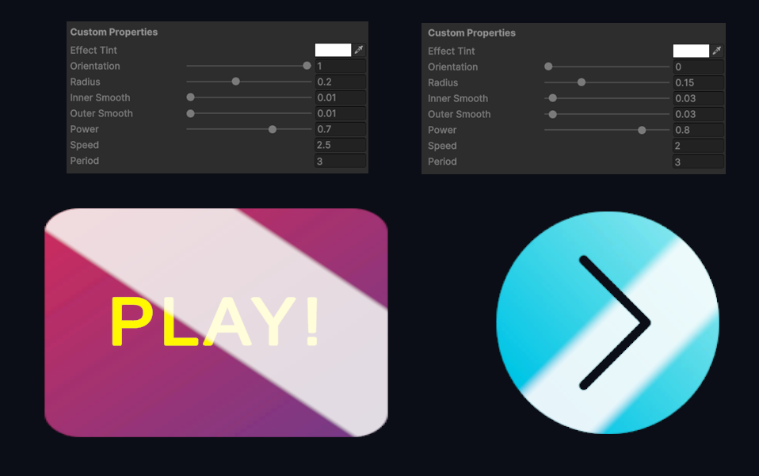
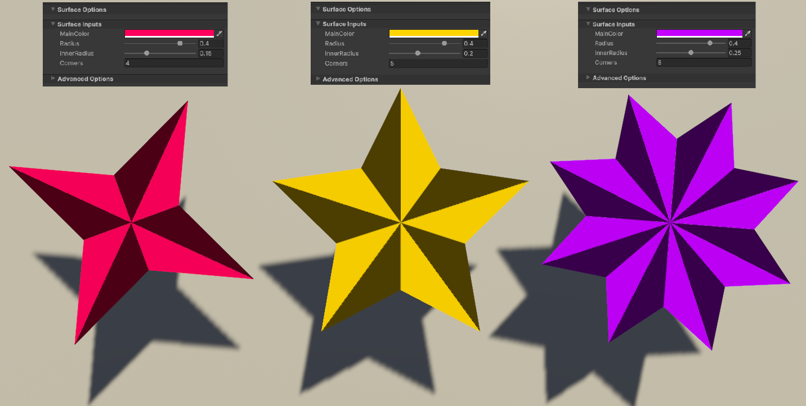
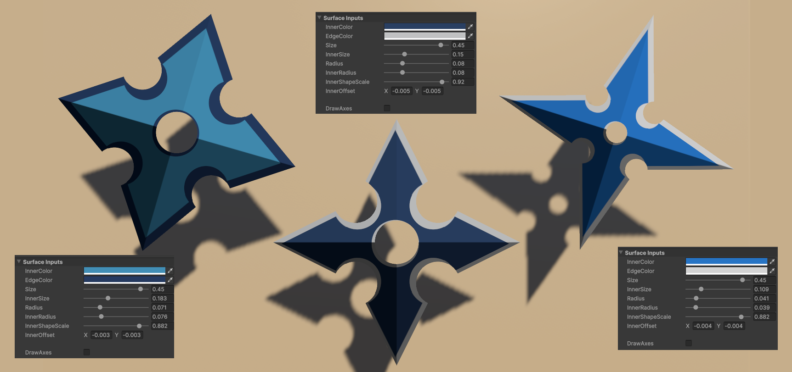
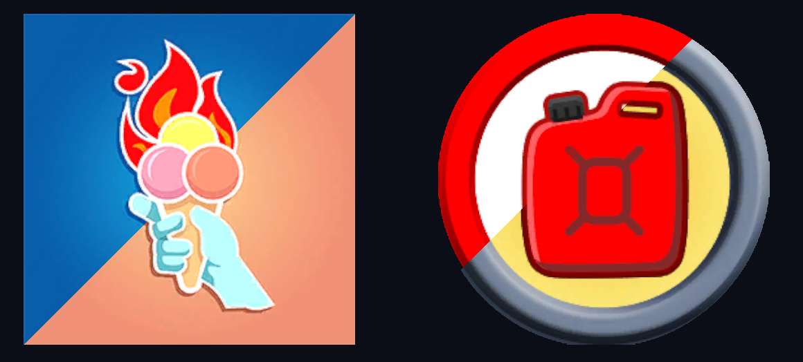
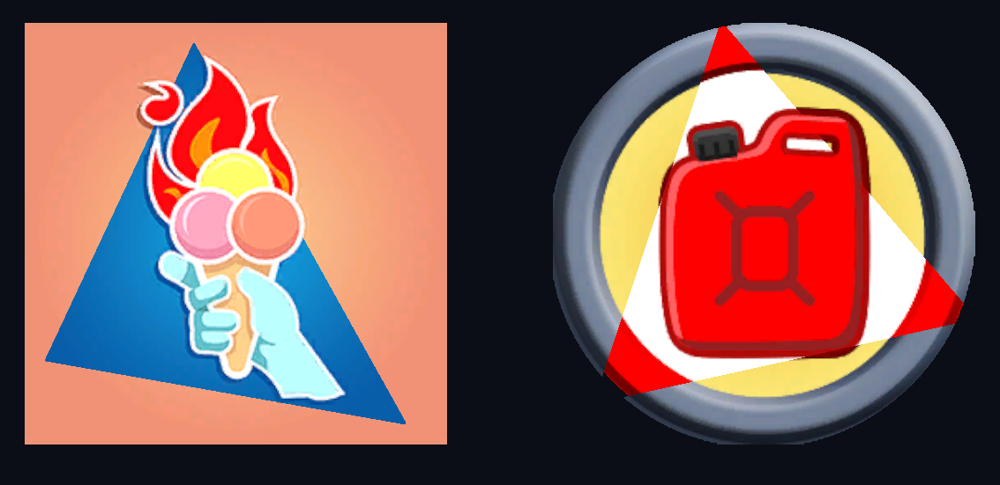
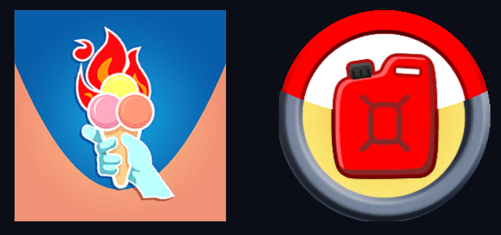
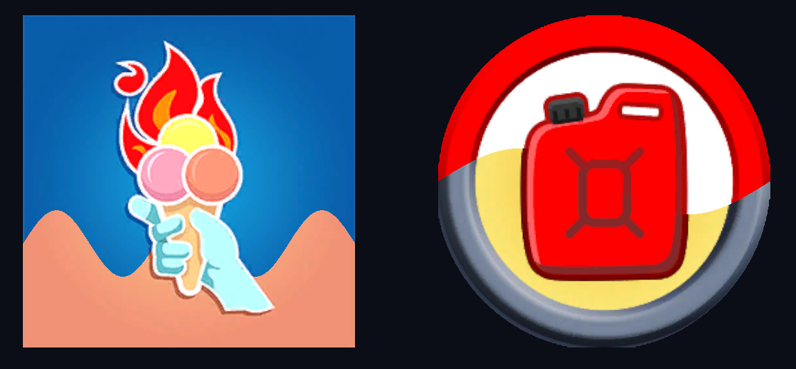
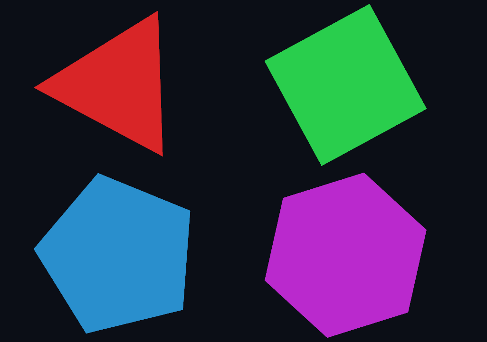

# Unity 2D Procedural Shape Examples

Procedural shapes allow users to create and manipulate shapes dynamically and animate them at runtime.

This repository provides 2D procedural example shapes at both basic and advanced levels. Provided basic shapes can be used to create more complex shapes.

## Advanced Examples

**2D Signed Distance Field (SDF):** This example provides an animation for UI (buttons and images) by using SDFs. It uses a modified version of the built-in UI shader of Unity.
  

**Star:** It provides an example procedural star shape which is highly customizable (number of corners, inner radius, etc.).
  

**Shurinken:** It provides an example procedural shurinken shape which is highly customizable.
  

## Basic Examples

This repository includes several basic shapes such as line, triangle, polygon, circle, quadratic and sinusoidal. They can be used as a base to be able to create more complex shapes. Following images belong to examples which blends two textures based on those shapes.

